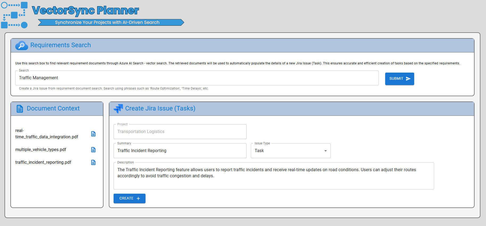

# Azure AI Jira Issue Manager

## Overview
Welcome to the Azure AI Jira Issue Manager repository! This project leverages the power of Azure AI Search, Azure OpenAI Service, LangChain, React.JS, and Python FastAPI to create an intelligent and efficient system for managing Jira issues. By integrating advanced AI search capabilities, the AI Jira Issue Manager allows for seamless retrieval and utilization of requirement documents, ensuring that tasks are accurately populated with relevant details. The front-end is built with React.JS, providing a user-friendly interface, while the back-end utilizes Python FastAPI for robust and high-performance API management. This combination of cutting-edge technologies streamlines project planning and issue management, making it an invaluable tool for any development team.

 

 

## Objectives

- **Document Retrieval Using Vector Search**: Utilize Azure AI Search to efficiently retrieve documents through vector search, enhancing the relevance and accuracy of the search results.
  
- **Jira Issue Creation with RAG Pattern**: Leverage the Retrieval-Augmented Generation (RAG) pattern and Azure OpenAI Service to automatically create Jira issues from the retrieved documents, ensuring that the issues are populated with accurate and relevant information.

- **Robust Backend System**: Implement a reliable and high-performance backend system using Python FastAPI to handle user requests and interactions, ensuring seamless communication between the front-end and the AI-powered search and generation services.

- **User-Friendly Front-End Interface**: Develop an intuitive front-end interface using React JS, providing users with an easy-to-navigate platform for performing vector searches and managing Jira issues effectively.
 

 

## Requirements
- Azure subscription for deploying Azure AI Search, Azure OpenAI and Storage Account.
- Python environment.
- Load documents and create vector embeddings with Azure AI Search: [Effortlessly Vectorize Your Data with Azure AI Search: Step-by-Step Tutorial](https://stochasticcoder.com/2024/07/26/effortlessly-vectorize-your-data-with-azure-ai-search-step-by-step-tutorial/)

## Usage
1. Follow the steps provided in the README file.

## Steps
1. Step 1 - Load documents and create vector embeddings with Azure AI Search: [Effortlessly Vectorize Your Data with Azure AI Search: Step-by-Step Tutorial](https://stochasticcoder.com/2024/07/26/effortlessly-vectorize-your-data-with-azure-ai-search-step-by-step-tutorial/)
2. [Step 2](api) - Create FastAPI to integrate Jira and LangChain RAG pattern with web front-end.
3. [Step 3](web) - Build the React web front-end to query requirement documents and generate Jira Issues. 
4. Follow the setup instructions provided in the README file.
5. Run the demo application and explore the RAG pattern in action.

## License
This project is licensed under the [MIT License](MIT.md), granting permission for commercial and non-commercial use with proper attribution.

## Support
For any questions or issues, please [open an issue](https://github.com/jonathanscholtes/LangChain-RAG-Pattern-with-AI-Search-Vector-Store-and-Jira/issues) on GitHub or reach out to the project maintainers.

## Disclaimer
This demo application is provided for educational and demonstration purposes only. Use at your own risk.

## Additional Tutorials
For more tutorials and coding example visit my site: [stochasticcoder.com](https://stochasticcoder.com/)