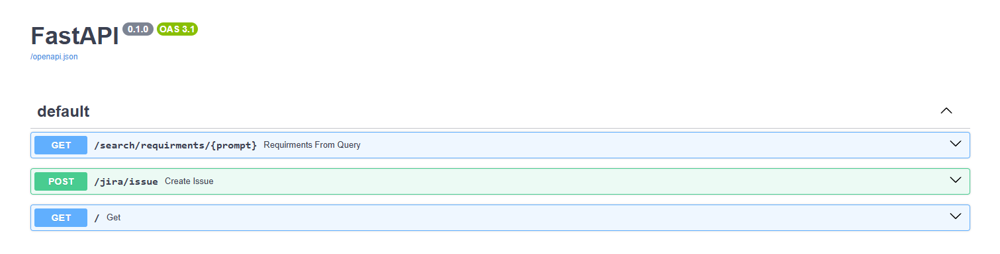

# Azure AI Jira Issue Manager - Python FastAPI


## Overview
Welcome to the Azure AI Jira Issue Manager api! This project leverages the power of Python FastAPI to create a robust and high-performance backend system for managing Jira issues. By integrating advanced AI search capabilities with Azure AI Search and Azure OpenAI Service, the AI Jira Issue Manager enables seamless retrieval and utilization of requirement documents, ensuring tasks are accurately populated with relevant details. While the front-end is built with React.JS for a user-friendly interface, Python FastAPI handles all user requests and interactions, providing a reliable and efficient API management. This combination of cutting-edge technologies streamlines project planning and issue management, making it an invaluable tool for any development team.

## Features
- Utilizes Python FastAPI for building a high-performance web API.
- Integrates Jira for Issue management and LangChain for Jira issue generation
- Utilizes Azure AI Search vector store for efficient text retrieval based on semantic similarity.

## Requirements
- Python environment with FastAPI, LangChain, and Azure SDK installed.
- Access to Azure subscription for deploying Azure AI Search, Azure OpenAI and Azure Storage Account.
- Create Jira [API tokens for your Atlassian account](https://support.atlassian.com/atlassian-account/docs/manage-api-tokens-for-your-atlassian-account/)
- Review [Jira Authentication](https://jira.readthedocs.io/examples.html#authentication)


## Usage
1. Clone the repository to your local machine.
2. Create **.env** file and populate:

- **AZURE_OPENAI_API_KEY**='\<Your Azure OpenAI API Key\>'
- **AZURE_OPENAI_ENDPOINT**='\<Your Azure OpenAI Endpoint\>'
- **AZURE_OPENAI_EMBEDDING**='\<Your Azure OpenAI embedding model, example:text-embedding\>'
- **AZURE_OPENAI_API_VERSION**='2023-05-15'
- **AZURE_SEARCH_ENDPOINT**='\<Your Azure AI Search Endpoint \>'
- **AZURE_SEARCH_API_KEY**='\<Your Azure AI Search API Key \>'
- **AZURESEARCH_FIELDS_CONTENT_VECTOR**='text_vector'
- **AZURESEARCH_FIELDS_CONTENT**='chunk'
- **JIRA_PROJECT_KEY**='\<Your Jira Project Key\>'
- **JIRA_EMAIL**='\<Jira Account for Authentication\>'
- **JIRA_API_TOKEN**='\<Jira API Token\>'
- **JIRA_URL**='https://\<Jira Server\>.atlassian.net/'

3. Create python env: 
```
python -m venv venv
```
4. Install Requirements:
```
venv\Scripts\activate
python -m pip install -r requirements.txt
```
5. Run the FastAPI server:
```
python app.py
```
6. View the Swagger Docs: [http://127.0.0.1:8000/docs](http://127.0.0.1:8000/docs)



## License
This project is licensed under the [MIT License](../MIT.md), granting permission for commercial and non-commercial use with proper attribution.

## Support
For any questions or issues, please [open an issue](https://github.com/jonathanscholtes/Azure-AI-Search-Vector-Store-LangChain-RAG-Pattern-with-Jira/issues) on GitHub or reach out to the project maintainers.

## Disclaimer
This project is provided for educational and demonstration purposes only. Use at your own risk.