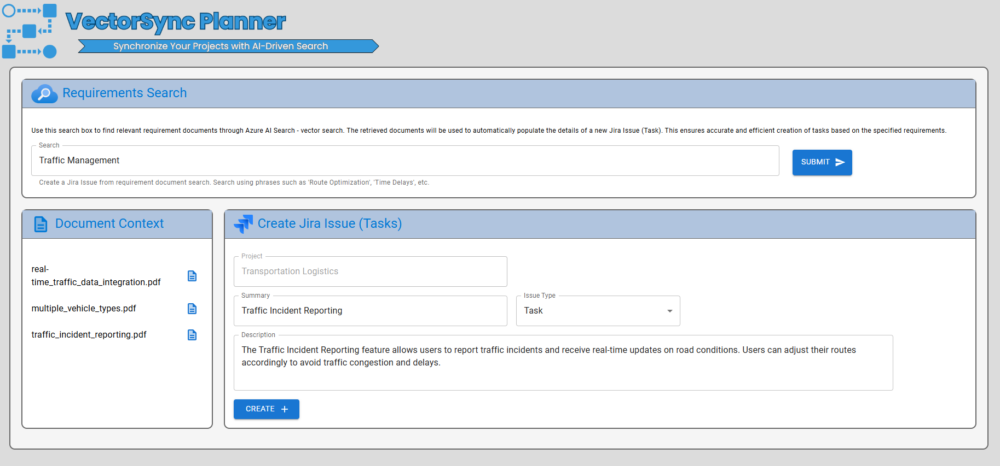
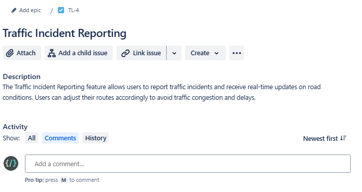

# Azure AI Jira Issue Manager - React.JS Web Interface


## Overview
Welcome to the Azure AI Jira Issue Manager web! This project features a user-friendly web interface built with React.JS, making it easy to manage Jira issues efficiently. By integrating advanced AI search capabilities with Azure AI Search and Azure OpenAI Service, the AI Jira Issue Manager allows for seamless retrieval and utilization of requirement documents, ensuring tasks are accurately populated with relevant details. The front-end, crafted with React.JS, ensures an intuitive and smooth user experience, while the Python FastAPI back-end provides robust and high-performance API management. 

## Features
- Utilizes React for building a modern and interactive user interface.
- Integrates Node.js for server-side logic and connecting to the FastAPI backend.
- Implements the LangChain with Azure OpenAI Server to generate Jira Issues.
- Display documents retrieved through Azure AI Search's similarity search.

## Requirements
- Node.js 20.11.1 installed in your development environment.
    - Please follow the steps outlined [here](https://stochasticcoder.com/2024/03/06/langchain-rag-with-react-fastapi-cosmos-db-vectors-part-3/#h-install-node-js) to download and install Node.JS.
- Access to a FastAPI backend for AI Agent.
- Basic knowledge of React, Node.js, FastAPI, and LangChain concepts.

## Usage
1. Clone the repository to your local machine.
2. Set up and configure the FastAPI backend for LangChain AI Agent.
3. Create **.env** file and populate:
- REACT_APP_API_HOST=http://127.0.0.1:8000
4. Perform a clean install of package dependancies:
```
npm ci
```
4. Start the Node.js server and run the React 18 application to interact with the AI Agent.
```
npm start
```




## License
This project is licensed under the [MIT License](../MIT.md), granting permission for commercial and non-commercial use with proper attribution.

## Support
For any questions or issues, please [open an issue](https://github.com/jonathanscholtes/LangChain-RAG-Pattern-with-AI-Search-Vector-Store-and-Jira/issues) on GitHub or reach out to the project maintainers.

## Disclaimer
This project is provided for educational and demonstration purposes only. Use at your own risk.